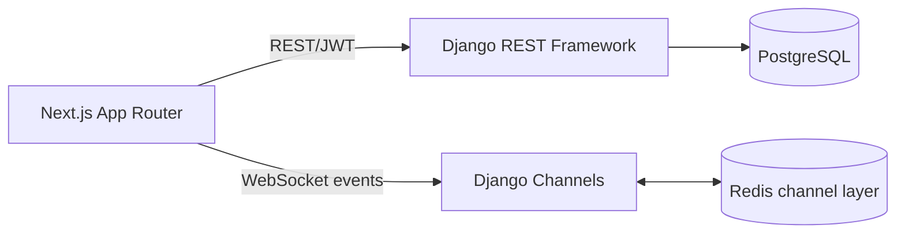

# Architecture

The browser stores only short-lived access and refresh tokens. Business data is fetched from DRF; the websocket emits invalidation-style project events after mutations, then the client re-fetches authoritative state. REST mutations use a `version` field for optimistic concurrency control.

Roles: owners administer the project; admins manage members; members create/edit work; viewers are read-only. Permissions are enforced in API views, not just hidden in the UI.
