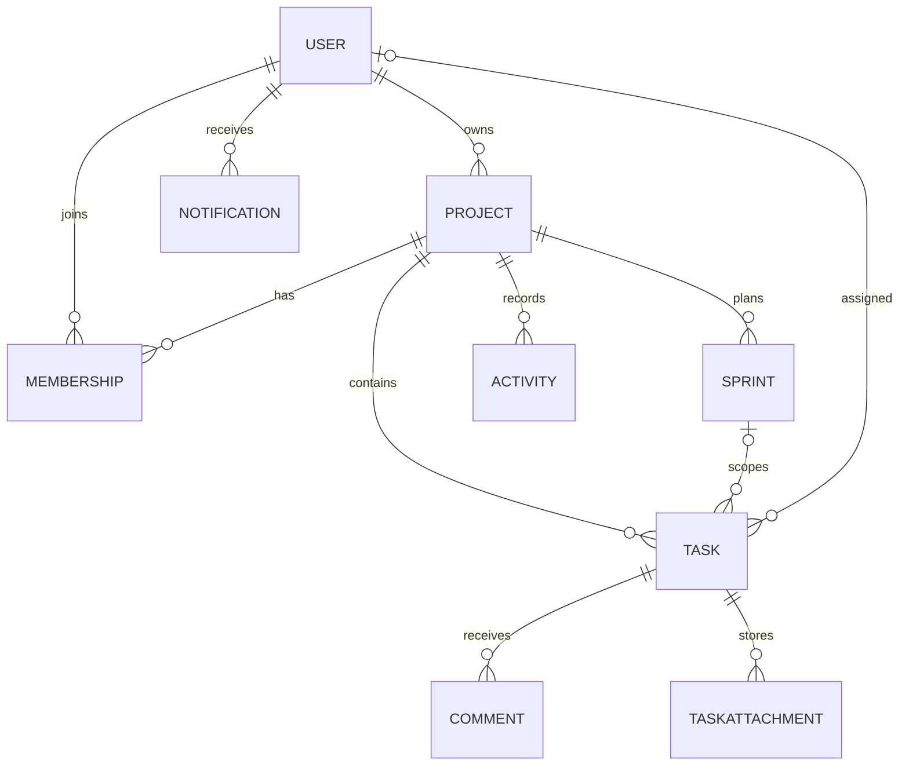

# Database model

Important invariants: membership is unique per user/project; only one active sprint can exist per project; task positions are unique inside a project status column; a task references its project through all collaboration records. Indexed project/status and project/assignee paths support the board and filtering queries.
